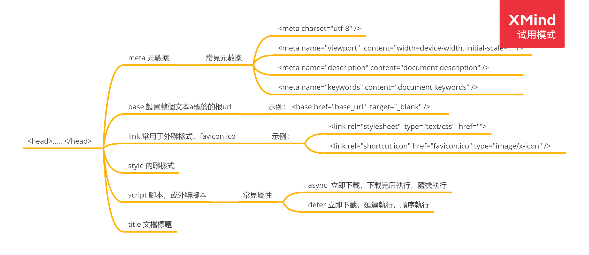
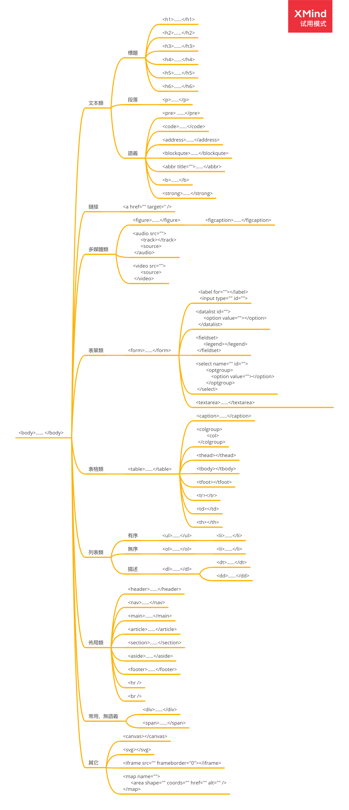

# HTML+CSS

## HTML 組成介紹，標籤分類





[《HTML 參考手冊》](https://www.w3cschool.cn/htmltags/)

## CSS 組成介紹，功能分類

### 概念

1. 語法：

   目標：{ 屬性：屬性值 }

   ```css
   // 示例：
   p: {
     color: #0000;
   }
   ```

2. @規則

   - `@charset`定義樣式表使用的字符集，一般設為`@charset "UTF-8";`即可
   - `@media` 如果滿足媒介查詢的條件則條件規則組裡的規則生效
   - `@page` 描述打印文檔時佈局的變化
   - `@keyframes` 描述 CSS 動畫的中間步驟

3. 層疊：

   是 CSS 的一個基本特徵，它是一個定義如何合併來自多個源的屬性值的算法。它在 CSS 處於核心地位，CSS 的全稱層疊樣式表正是強調了這一點。

   | 層級 | 來源                      | 重要程度                                                                                           |
   | :--- | :------------------------ | -------------------------------------------------------------------------------------------------- |
   | 1    | 瀏覽器                    | 普通                                                                                               |
   | 2    | 用戶設置                  | 普通                                                                                               |
   | 3    | 頁面作者                  | 普通                                                                                               |
   | 4    | CSS 動畫                  | 关键帧不参与层叠，意味着在任何时候 CSS 都是取单一的@keyframes 的值而不会是某几个@keyframe 的混合。 |
   | 5    | 瀏覽器                    | `!important`                                                                                       |
   | 6    | 頁面作者                  | `!important`                                                                                       |
   | 7    | 用戶                      | `!important`                                                                                       |
   | 8    | css 過渡(css transitions) |                                                                                                    |

   **相同層級時按：类型选择器 < 类选择器 < ID 选择器**

4. 屬性繼承

   當元素的一個元素沒有指定值時，則取父元素的同屬性的計算值

### 樣式初始化

[normalize.css](./normalize.css)

[bootstrap-reboot](./bootstrap-reboot.css)

### 選擇器

| 選擇器                                                                                       | 示例                   | 示例說明                                                             | CSS |
| :------------------------------------------------------------------------------------------- | :--------------------- | :------------------------------------------------------------------- | :-- |
| [._class_](https://www.w3cschool.cn/cssref/sel-class.html)                                   | .intro                 | 選擇所有 class="intro" 的元素                                        | 1   |
| [#_id_](https://www.w3cschool.cn/cssref/sel-id.html)                                         | #firstname             | 選擇所有 id="firstname" 的元素                                       | 1   |
| [\*](https://www.w3cschool.cn/cssref/sel-all.html)                                           | \*                     | 選擇所有元素                                                         | 2   |
| _[element](https://www.w3cschool.cn/cssref/sel-element.html)_                                | p                      | 選擇所有 `<p>` 元素                                                  | 1   |
| _[element,element](https://www.w3cschool.cn/cssref/sel-element-comma.html)_                  | div,p                  | 選擇所有 `<div>` 元素和 `<p>` 元素                                   | 1   |
| [_element element_](https://www.w3cschool.cn/cssref/sel-element-element.html)                | div p                  | 選擇 `<div>` 元素內的所有 `<p>` 元素                                 | 1   |
| [_element_>_element_](https://www.w3cschool.cn/cssref/sel-element-gt.html)                   | div>p                  | 選擇所有父級是 `<div>` 元素的 `<p>` 元素                             | 2   |
| [_element_+_element_](https://www.w3cschool.cn/cssref/sel-element-pluss.html)                | div+p                  | 選擇所有緊接著 `<div>` 元素之後的 `<p>` 元素                         | 2   |
| [[_attribute_\]](https://www.w3cschool.cn/cssref/sel-attribute.html)                         | [target]               | 選擇所有帶有 target 屬性元素                                         | 2   |
| [[_attribute_=_value_\]](https://www.w3cschool.cn/cssref/sel-attribute-value.html)           | [target=_blank]        | 選擇所有使用 target="\_blank" 的元素                                 | 2   |
| [[_attribute_~=_value_\]](https://www.w3cschool.cn/cssref/sel-attribute-value-contains.html) | [title~=flower]        | 選擇標題屬性包含單詞"flower" 的所有元素                              | 2   |
| [[_attribute_\|=_language_\]](https://www.w3cschool.cn/cssref/sel-attribute-value-lang.html) | [lang\|=en]            | 選擇一個 lang 屬性以 en 為開頭的所有元素                             | 2   |
| [:link](https://www.w3cschool.cn/cssref/sel-link.html)                                       | a:link                 | 選擇所有未訪問鏈接                                                   | 1   |
| [:visited](https://www.w3cschool.cn/cssref/sel-visited.html)                                 | a:visited              | 選擇所有訪問過的鏈接                                                 | 1   |
| [:active](https://www.w3cschool.cn/cssref/sel-active.html)                                   | a:active               | 選擇活動鏈接                                                         | 1   |
| [:hover](https://www.w3cschool.cn/cssref/sel-hover.html)                                     | a:hover                | 選擇鼠標在鏈接上面時                                                 | 1   |
| [:focus](https://www.w3cschool.cn/cssref/sel-focus.html)                                     | input:focus            | 選擇具有焦點的輸入元素                                               | 2   |
| [:first-letter](https://www.w3cschool.cn/cssref/sel-firstletter.html)                        | p:first-letter         | 選擇每一個 `<p>` 元素的第一個字母                                    | 1   |
| [:first-line](https://www.w3cschool.cn/cssref/sel-firstline.html)                            | p:first-line           | 選擇每一個 `<p>` 元素的第一行                                        | 1   |
| [:first-child](https://www.w3cschool.cn/cssref/sel-firstchild.html)                          | p:first-child          | 指定只有當 `<p>` 元素是其父級的第一個子級的樣式。                    | 2   |
| [:before](https://www.w3cschool.cn/cssref/sel-before.html)                                   | p:before               | 在每個 `<p>` 元素之前插入內容                                        | 2   |
| [:after](https://www.w3cschool.cn/cssref/sel-after.html)                                     | p:after                | 在每個 `<p>` 元素之後插入內容                                        | 2   |
| [:lang(_language_)](https://www.w3cschool.cn/cssref/sel-lang.html)                           | p:lang(it)             | 選擇一個 lang 屬性的起始值="it"的所有< p> 元素                       | 2   |
| [_element1_~_element2_](https://www.w3cschool.cn/cssref/sel-gen-sibling.html)                | p~ul                   | 選擇 `<p>` 元素之後的每一個 `<ul>` 元素                              | 3   |
| [[_attribute_^=_value_\]](https://www.w3cschool.cn/cssref/sel-attr-begin.html)               | a[src^="https"]        | 選擇每一個 src 屬性的值以"https" 開頭的元素                          | 3   |
| [[_attribute_\$=_value_\]](https://www.w3cschool.cn/cssref/sel-attr-end.html)                | a[src$=".pdf"]         | 選擇每一個 src 屬性的值以".pdf" 結尾的元素                           | 3   |
| [[*attribute\*\*=*value\*\]](https://www.w3cschool.cn/cssref/sel-attr-contain.html)          | a[src*="W3Cschool"]    | 選擇每一個 src 屬性的值包含子字符串"W3Cschool" 的元素                | 3   |
| [:first-of-type](https://www.w3cschool.cn/cssref/sel-first-of-type.html)                     | p:first-of-type        | 選擇每個 `<p>` 元素是其父級的第一個 `<p>` 元素                       | 3   |
| [:last-of-type](https://www.w3cschool.cn/cssref/sel-last-of-type.html)                       | p:last-of-type         | 選擇每個 `<p>` 元素是其父級的最後一個 `<p>` 元素                     | 3   |
| [:only-of-type](https://www.w3cschool.cn/cssref/sel-only-of-type.html)                       | p:only-of-type         | 選擇每個 `<p>` 元素是其父級的唯一 `<p>` 元素                         | 3   |
| [:only-child](https://www.w3cschool.cn/cssref/sel-only-child.html)                           | p:only-child           | 選擇每個 `<p>` 元素是其父級的唯一子元素                              | 3   |
| [:nth-child(_n_)](https://www.w3cschool.cn/cssref/sel-nth-child.html)                        | p:nth-child(2)         | 選擇每個 `<p>` 元素是其父級的第二個子元素                            | 3   |
| [:nth-last-child(_n_)](https://www.w3cschool.cn/cssref/sel-nth-last-child.html)              | p:nth-last-child(2)    | 選擇每個 `<p>` 元素的是其父級的第二個子元素，從最後一個子項計數      | 3   |
| [:nth-of-type(_n_)](https://www.w3cschool.cn/cssref/sel-nth-of-type.html)                    | p:nth-of-type(2)       | 選擇每個 `<p>` 元素是其父級的第二個 `<p>` 元素                       | 3   |
| [:nth-last-of-type(_n_)](https://www.w3cschool.cn/cssref/sel-nth-last-of-type.html)          | p:nth-last-of-type( 2) | 選擇每個 `<p>` 元素的是其父級的第二個 `<p>` 元素，從最後一個子項計數 | 3   |  | [:last-child](https://www.w3cschool.cn/cssref/sel-last-child.html) | p:last-child | 選擇每個 `<p>` 元素是其父級的最後一個子級。 | 3 |
| [:root](https://www.w3cschool.cn/cssref/sel-root.html)                                       | :root                  | 選擇文檔的根元素                                                     | 3   |
| [:empty](https://www.w3cschool.cn/cssref/sel-empty.html)                                     | p:empty                | 選擇每個沒有任何子級的 `<p>` 元素（包括文本節點）                    | 3   |
| [:target](https://www.w3cschool.cn/cssref/sel-target.html)                                   | #news:target           | 選擇當前活動的 #news 元素（包含該錨名稱的點擊的 URL ）               | 3   |
| [:enabled](https://www.w3cschool.cn/cssref/sel-enabled.html)                                 | input:enabled          | 選擇每一個已啟用的輸入元素                                           | 3   |
| [:disabled](https://www.w3cschool.cn/cssref/sel-disabled.html)                               | input:disabled         | 選擇每一個禁用的輸入元素                                             | 3   |
| [:checked](https://www.w3cschool.cn/cssref/sel-checked.html)                                 | input:checked          | 選擇每個選中的輸入元素                                               | 3   |
| [:not(_selector_)](https://www.w3cschool.cn/cssref/sel-not.html)                             | :not(p)                | 選擇每個並非 `<p>` 元素的元素                                        | 3   |
| [::selection](https://www.w3cschool.cn/cssref/sel-selection.html)                            | ::selection            | 匹配元素中被用戶選中或處於高亮狀態的部分                             | 3   |
| [:out-of-range](https://www.w3cschool.cn/cssref/sel-out-of-range.html)                       | :out-of-range          | 匹配值在指定區間之外的 `<input >` 元素                               | 3   |
| [:in-range](https://www.w3cschool.cn/cssref/sel-in-range.html)                               | :in-range              | 匹配值在指定區間之內的 `<input>` 元素                                | 3   |
| [:read-write](https://www.w3cschool.cn/cssref/sel-read-write.html)                           | :read-write            | 用於匹配可讀及可寫的元素                                             | 3   |
| [:read-only](https://www.w3cschool.cn/cssref/sel-read-only.html)                             | :read-only             | 用於匹配設置"readonly"（只讀） 屬性的元素                            | 3   |
| [:optional](https://www.w3cschool.cn/cssref/sel-optional.html)                               | :optional              | 用於匹配可選的輸入元素                                               | 3   |
| [:required](https://www.w3cschool.cn/cssref/sel-required.html)                               | :required              | 用於匹配設置了 "required" 屬性的元素                                 | 3   |
| [:valid](https://www.w3cschool.cn/cssref/sel-valid.html)                                     | :valid                 | 用於匹配輸入值為合法的元素                                           | 3   |
| [:invalid](https://www.w3cschool.cn/cssref/sel-invalid.html)                                 | :invalid               | 用於匹配輸入值為非法的元素                                           | 3   |

### 常見單位

1. 顏色
   - 十六進制：#ffffff
   - RGB：rgb(255,255,255)
   - RGBA：rgba(255,255,255,1)
2. 尺寸

   - px
   - em/rem
   - vw/vh
   - %
   - pt

### 主要功能分類

- 文本：

  用於控製文本相關的樣式和行為，例如：顏色、間距、行高、換行、對齊、大小寫、線條……

- 列表：

  用於有、無序列表的項標記

- 表格：

  用於控制單元格之間的間距、表格佈局等

- 背景：

  用於控制元素背景，例如：顏色，圖片，位置，展示方式，重複顯示、大小……

- 尺寸：

  用於控制元素的寬度、高度、最大/小寬度，最大/小高度

- 邊框：

  用於控制元素的邊框、邊框的圓角、輪廓，例如：大小，展示方式，顏色

- 內外間距：

  以邊框為界，元素內外的距離分別為內外間距，外間距可以為負值

- 顯示/隱藏/消失：

  控制元素展示形式，塊級元素、內聯元素、行內元素，顯示、佔位隱藏、消失、溢出……

- 定位：

  用於控制元素位置相關，相對定位、絕對定位，元素顯示層級，浮動……

- 過渡（transtion）：

  控制一個元素在不同狀態之間切換的時候定義不同的過渡效果，需過度屬性、時長、速度曲線、開始時間

- 動畫（animation）：

  進化版的過度，可以控制每一幀的樣式及其值的變化，還循環等高級功能

- 轉換(transform)：

  控制元素旋轉，縮放，移動，傾斜

- 其它雜項

[《CSS 參考手冊》](https://www.w3cschool.cn/cssref/3ps212do.html#multicol)

### 盒子模型


- Margin（外邊距） - 清除邊框區域。 Margin 沒有背景顏色，它是完全透明
- Border（邊框） - 邊框周圍的填充和內容。邊框是受到盒子的背景顏色影響
- Padding（內邊距） - 清除內容周圍的區域。會受到框中填充的背景顏色影響
- Content（內容） - 盒子的內容，顯示文本和圖像

寬度計算：  
元素实际宽度（盒子的宽度）=左 Margin+左 Border+左 Padding+Content+右 Padding+右 Border+右 Margin。  
高度計算：  
元素实际高度（盒子的高度）=頂部 Margin+頂部 Border+頂部 Padding+Content+底部 Padding+底部 Border+底部 Margin。

與盒子模型相關的屬性:
`box-sizing: content-box|border-box;`

1. content-box:
   width = content width
   height = content height
2. border-box:
   width = border + padding + content width
   heigth = border + padding + content heigth

### 彈性盒子

| 属性                                                                            | 说明                                                                         | CSS |
| :------------------------------------------------------------------------------ | :--------------------------------------------------------------------------- | :-- |
| [flex](https://www.w3cschool.cn/cssref/css3-pr-flex.html)                       | 复合属性。设置或检索弹性盒模型对象的子元素如何分配空间。                     | 3   |
| [flex-grow](https://www.w3cschool.cn/cssref/css3-pr-flex-grow.html)             | 设置或检索弹性盒的扩展比率。                                                 | 3   |
| [flex-shrink](https://www.w3cschool.cn/cssref/css3-pr-flex-shrink.html)         | 设置或检索弹性盒的收缩比率。                                                 | 3   |
| [flex-basis](https://www.w3cschool.cn/cssref/css3-pr-flex-basis.html)           | 设置或检索弹性盒伸缩基准值。                                                 | 3   |
| [flex-flow](https://www.w3cschool.cn/cssref/css3-pr-flex-flow.html)             | 复合属性。设置或检索弹性盒模型对象的子元素排列方式。                         | 3   |
| [flex-direction](https://www.w3cschool.cn/cssref/css3-pr-flex-direction.html)   | 该属性通过定义 flex 容器的主轴方向来决定 felx 子项在 flex 容器中的位置。     | 3   |
| [flex-wrap](https://www.w3cschool.cn/cssref/css3-pr-flex-wrap.html)             | 该属性控制 flex 容器是单行或者多行，同时横轴的方向决定了新行堆叠的方向。     | 3   |
| [align-content](https://www.w3cschool.cn/cssref/css3-pr-align-content.html)     | 在弹性容器内的各项没有占用交叉轴上所有可用的空间时对齐容器内的各项（垂直）。 | 3   |
| [align-items](https://www.w3cschool.cn/cssref/css3-pr-align-items.html)         | 定义 flex 子项在 flex 容器的当前行的侧轴（纵轴）方向上的对齐方式。           | 3   |
| [align-self](https://www.w3cschool.cn/cssref/css3-pr-align-self.html)           | 定义 flex 子项单独在侧轴（纵轴）方向上的对齐方式。                           | 3   |
| [justify-content](https://www.w3cschool.cn/cssref/css3-pr-justify-content.html) | 设置或检索弹性盒子元素在主轴（横轴）方向上的对齐方式。                       | 3   |
| [order](https://www.w3cschool.cn/cssref/css3-pr-order.html)                     | 设置或检索弹性盒模型对象的子元素出现的順序。                                 | 3   |

[Flex 布局教程：语法篇](http://www.ruanyifeng.com/blog/2015/07/flex-grammar.html)

[Flex 布局教程：实例篇](http://www.ruanyifeng.com/blog/2015/07/flex-examples.html)

## 經典佈局案例講解

1. 兩列佈局，左側定寬，右側自適應
2. 兩列佈局，一列不固定，另一列自適應
3. 三列佈局，兩側定框，中間自適應
4. 全局佈局

工具：https://jsbin.com/?html,output

## 作業

動手做出以上佈局

## 下堂課

### SASS 語法基礎教學

### Bootstrap css 部份源碼解析

1
2
3
